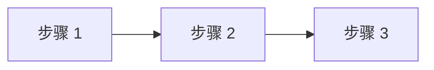

# Plan: {{title}}

## 1. 方案概述

- 整体思路
- 涉及领域（后端 / 前端 / 数据库）

## 2. 涉及文件

| 文件 | 改动类型 | 改动内容 |
|------|---------|---------|
| backend/handlers/xxx.go | 新增/修改 | |
| miniprogram/src/pages/xxx.vue | 新增/修改 | |

## 3. 实施步骤

### 步骤 1: xxx
- 做什么
- 为什么

### 步骤 2: xxx
- 做什么
- 为什么

## 4. 风险与回退

| 风险 | 概率 | 应对 |
|------|------|------|
| | 低/中/高 | |

---

## 变更记录

| 日期 | 版本 | 变更内容 | 作者 |
|------|------|---------|------|
| {{date}} | v0.1 | 初稿 | |
